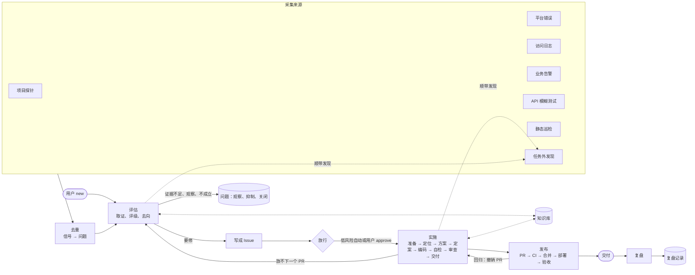
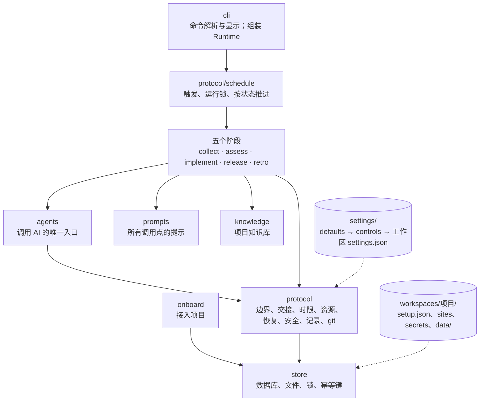

# 总体架构

tightrein 是一条无人值守、受人控制的缺陷修复流水线：从项目的运行数据与代码里找线索，判断是不是问题，要修的写成 Issue，交给 AI 编码 agent 在隔离的 worktree 里改，自检与审查通过后提 PR、合并、上线后确认，最后检查 tightrein 自己这一轮跑得怎么样。每一步都在协议层定下的边界内：agent 能读写什么、能跑哪些命令、最多改多少、用多少额度、哪些事必须人来定。

本文只讲各部分怎么组成、彼此什么关系。每个部分怎么做、为什么这样做，写在它自己文件夹的 `README.md`(设计依据一节带出处)。

## 五个阶段

| 阶段 | 控制键 | 做什么 | 小步骤 | 调用模型 |
|---|---|---|---|---|
| 采集 | `collect` | 从七个来源收集疑似问题的线索(信号)，不做判断；最后一步去重，把信号整理成问题(新发现或回归) | 项目探针、平台错误、访问日志、业务告警、API 模糊测试、静态巡检、任务外发现，去重 | 只有静态巡检 |
| 评估 | `assess` | 判断问题是否存在；存在的定严重度(P0 到 P3)、处理方式与粗规模；要修的写成 Issue 并等放行 | 选题、主张、查重、取证、证伪复核(高风险)、评级、去向，写成 Issue | 是 |
| 实施 | `implement` | 把放行的 Issue 落成通过自检与审查的代码，一条流程，按已有信息跳过 | 准备、定位、方案、定案、编码、自检、审查、交付 | 是 |
| 发布 | `release` | 提交、同步主干、推送、提 PR、等 CI、合并(合并队列)、跟踪部署、验收、清理 | 提 PR、CI、合并、部署、验收、清理 | 否 |
| 复盘 | `retro` | 每次运行结束检查 tightrein 自己的问题(失败、浪费、误判、打扰)，记进记录簿附解决思路与评级；不改任何东西 | 检测、合并或新建、评级、写思路 | 只为新记录写思路 |

原来的聚合并入采集(去重)，立项并入评估(写成 Issue)，验收并入发布。

人工关卡(虚线以外的停顿)：Issue 放行、方案定案、合并，以及需要拍板的时候。哪些可以配置为自动在 `boundaries.gates`，必须人工的(禁改文件被改、高风险路径的合并、超出改动量上限、需要拍板)写死在协议层。停下时给人看的只有三种文档：待审核、出问题、交付。

## 分层

| 层 | 目录(`src/tightrein/` 下) | 职责 |
|---|---|---|
| 入口 | `cli/` | 只解析命令与显示，数据都从 store 与交接文件读；`assemble.py` 是唯一接触真实外部依赖(环境变量、子进程、时钟、终端)的地方，拼好 `Runtime` 交给调度与各阶段 |
| 接入 | `onboard/` | 建工作区、探测仓库、试跑、就绪；`setup.json` 是每个模块启用与否的唯一来源 |
| 调度 | `protocol/schedule/` | 三种触发(定时、事件、手动)、能跑的时段、运行锁与心跳、按状态推进到关卡、跑完必复盘、对象熔断；macOS 上的 launchd |
| 阶段 | `collect/`、`assess/`、`implement/`、`release/`、`retro/` | 每个阶段、模块、小步骤一个文件夹，旁边放 README、输出的 schema、方法清单 |
| 能力 | `agents/`、`prompts/`、`knowledge/` | 调用 AI 的统一参数与结果(claude、agy、codex 的适配器)；一个调用点一个提示模板；按位置匹配的项目知识 |
| 协议 | `protocol/` | 跨所有阶段的全局规则，每一方面一个 md 加同名程序 |
| 存储 | `store/` | 所有读写的唯一入口：文件存内容，数据库只存查询与状态，除计数外都能从文件重建 |

仓库根下：`settings/`(全局取值)、`vendor/`(锁定版本的第三方 skills)、`tests/`(结构与包一一对应)、`docs/`、`workspaces/<项目>/`(各项目的工作区，不进 git)。

## 协议层

协议层定跨所有阶段的全局规则；规则与缺省值的含义在 `protocol/`，取值在 `settings/`。

| 方面 | 文件 | 管什么 |
|---|---|---|
| 边界与关卡 | `boundaries.md` | 各阶段能读写什么、只读命令白名单、改动量上限、受保护文件(禁改与高风险两级)、必须人工的关卡 |
| 命名与排版 | `naming.md` | 目录、文件名、编号、时间与时长的写法；中文与英文的分工 |
| 交接 | `handoff.md` | 每一步交出的东西分四部分：结论、必填事实、量化数据、备注；每步落盘一份 `handoff.json`，也是检查点 |
| 运行时限 | `limits.md` | 三级超时、轮数、没有进展就停、按失败类型处理、重试与退避、熔断、锁的心跳 |
| 资源 | `resources.md` | 并发与限流、订阅额度与给用户留的余量、每个 Issue 的 token 上限 |
| 恢复与控制 | `recovery.md` | 检查点续跑、写操作幂等、中断时就地收尾、启动时恢复、暂停、急停、接管 |
| 安全 | `security.md` | 凭据、脱敏、子进程环境变量白名单、只读副本与快照比对、外部内容当数据不当指令 |
| 记录 | `records.md` | 事件记录链、版本、保留期与清理 |
| 调度 | `schedule.md` | 见上 |
| git | `git.md` | 格式按项目约定 → 历史推断 → 通用；分支、提交、PR；不带 AI 署名；永不直接写主分支 |
| 代码规范 | `coding.md` | 给被管理项目写代码时的最低要求 |

统一的控制字段(`model`、`fallback`、`timeout`、`turns`、`inputTokens`、`rounds`、`access`、`network` 等)按控制键「阶段.模块.小步骤」逐层继承：`implement.design.frontend` 没写的取 `implement.design`，再取 `implement`，最后取 `*`。

## 各层怎么配合：一次运行

1. `tightrein run`(或 launchd 定时调用)经 `cli/assemble.py` 组装 `Runtime`：合并后的 settings、接入清单、数据库连接、git、agent 调用上下文、脱敏器、事件记录；
2. 调度查暂停、急停与额度，取运行锁，登记运行，启动恢复(把上次中断的退回检查点)，按保留期清理；
3. 按顺序推进：采集到点的来源 → 评估待评估的问题 → 实施一个 Issue(一步一步推，停在关卡或停下为止) → 发布中的 Issue 走合并队列、验收中的接着看 → 复盘；每一步都包在独立的错误边界里，一个对象连续失败到上限即熔断交人；
4. 每一步写一份 `handoff.json`(量化数据全由程序统计)，下一步只读前三部分；给人看的文档由程序从它渲染；
5. 模型调用都经 `agents.call`：参数按调用点从 settings 取，提示由 `prompts/build.py` 拼，子进程环境按白名单给，失败后重试、换备用还是停只由 `protocol/limits.py` 决定，用量记进额度与每个 Issue 的预算；
6. 读写都经 `store`：对外写操作(推送、提 PR、合并)带幂等键，中断后重跑不会做两次。

## 数据在哪里

| 内容 | 位置 |
|---|---|
| 全局取值 | `settings/defaults.json`(提交)、`controls.json`、`sites.json`、`secrets.json`(本机) |
| 项目的选择与取值 | `workspaces/<项目>/setup.json`、`settings.json`、`sites.json`、`secrets.json` |
| 问题 | `workspaces/<项目>/data/problems/<编号>/`，索引在 problems 表 |
| Issue | `workspaces/<项目>/data/issues/<编号>/`：记录、正文、代码笔记、各步交接、三种给人看的文档 |
| 运行 | `workspaces/<项目>/data/runs/<运行编号>/`：各来源与去重的交接、事件记录 `events.jsonl` |
| 复盘记录 | `workspaces/<项目>/data/retro/` |
| 知识库 | `workspaces/<项目>/knowledge/<类>/` |

数据库(`data/tightrein.db`)坏了可以 `tightrein admin rebuild` 从文件重建。

## 再往下读

- 第一次用：[第一次运行](../tutorials/first-run.md)；
- 每个阶段的流程与设计依据：`src/tightrein/<阶段>/README.md`；
- 协议层每一项与缺省值：`src/tightrein/protocol/README.md`；
- 命令、配置字段、交接格式：[参考](../reference/commands.md)。
